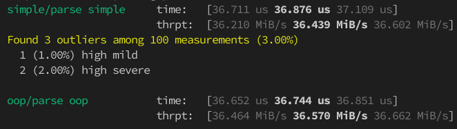

- [Rhai LSP](#rhai-lsp)
  - [Requirements](#requirements)
  - [Project Structure](#project-structure)
    - [`crates/rowan`](#cratesrowan)
    - [`crates/lsp`](#crateslsp)
    - [`crates/sourcegen`](#cratessourcegen)
    - [`editors/vscode`](#editorsvscode)
  - [Tests](#tests)
  - [Benchmarks](#benchmarks)
  - [Profiling](#profiling)
  - [Contributing](#contributing)
    - [Development Process](#development-process)
      - [Building and Installing the VSCode Extension](#building-and-installing-the-vscode-extension)
      - [Building the Rhai CLI](#building-the-rhai-cli)
      - [Debugging the Language Server](#debugging-the-language-server)
      - [Building the VSCode Extension](#building-the-vscode-extension)
        - [Requirements](#requirements-1)
        - [Build Steps](#build-steps)

# Rhai LSP

Experimental Rhai LSP Server and IDE support.

It's incomplete and not recommended for general use yet, everything can be subject to changes.

## Requirements

- Stable Rust toolchain is required (e.g. via [rustup](https://rustup.rs/))
- ... other required tools are described in the appropriate sections

## Project Structure

### [`crates/rowan`](crates/rowan)

Rhai syntax and a recursive descent parser based on [Rowan](https://github.com/rust-analyzer/rowan).

The high-level syntax ([ungrammar](https://rust-analyzer.github.io/blog/2020/10/24/introducing-ungrammar.html)) definition is found in [crates/rowan/src/ast/rhai.ungram](crates/rowan/src/ast/rhai.ungram). The parser mimics the structure and produces a fitting CST.

### [`crates/lsp`](crates/lsp)

The LSP server implementation backed up by [lsp-async-stub](https://github.com/tamasfe/taplo/tree/master/lsp-async-stub).

It can be compiled to WASM only right now, but native binaries with stdio or TCP communication can be easily implemented.

### [`crates/sourcegen`](crates/sourcegen)

Crate for source generation.

Currently only some node types and helper macros are generated from the ungrammar definition. Later the AST will also be generated from it.

### [`editors/vscode`](ide/vscode)

VS Code extension that uses the LSP.

If all the tools are available from the [Requirements](#requirements), it can be built and installed with `task ide:vscode:dev`.

## Tests

Run all tests with `cargo test`.

[Parser tests](crates/rowan/tests) are based on scripts found in [`testdata`](testdata), and also in the upstream [rhai submodule](rhai/scripts).

## Benchmarks

Run benchmarks with `cargo bench`.

Current parser results:



We can only go up from here. (although it is 3 times faster than a similar LALR generated parser)

## Profiling

To profile the parser, run `cargo bench --bench parse -- --profile-time 5`.

The flame graph outputs can be found in `target/criterion/profile` afterwards.

## Contributing

The documentation is still pretty much WIP (as everything else). All contributions are welcome!

### Development Process

Currently the following steps are used to develop the project via vscode:

#### Building the Rhai CLI

```sh
cargo install --path crates/rhai-cli --debug
```

This will build and install the `rhai` executable globally that the vscode extension can also use.

#### Debugging the Language Server

The debugging process can consist of either strategically placed `tracing::info` statements that are visible in the VSCode debug console under `Rhai LSP`, or attaching a debugger to the running `rhai` process via [LLDB VSCode](https://marketplace.visualstudio.com/items?itemName=lanza.lldb-vscode). Both approaches deemed sufficient so far.

#### Building the VSCode Extension

The vscode extension relies on rhai-lsp compiled to WebAssembly via [`rhai-wasm`](./crates/rhai-wasm). There are several related [js libraries](./js) that are built on top of it.

##### Requirements

- The usual Rust tools along with the `wasm32-unknown-unknown` target, (`rustup target add wasm32-unknown-unknown`).
- NodeJs with proper PATH variables set up.
- Yarn (`npm i -g yarn`)
- vsce (`npm i -g vsce`)

##### Build Steps

You'll need to build all local js libraries in dependency order:

First the core js library with common utilities:

```sh
# from js/core

yarn install --force
yarn build
```

Then the LSP wrapper, it will also build the WASM library:

```sh
# from js/lsp

yarn install --force
yarn build
```

Finally the extension itself:

```sh
# from editors/vscode

yarn install --force
vsce package --no-yarn
```

Then you can use vscode to install the packaged extension via the UI or the following command:

```sh
code --install-extension rhai-0.0.0.vsix --force
```

After this the Rhai extension will be available in vscode.

If you modify any of the packages, unfortunately you will have to build all dependent packages manually, e.g. if you modify `js/core`, you will have to repeat all the above steps.

Unless you wish to develop any of the javascript parts (the libraries or the extension itself), instead of rebuilding the extension, it is enough to install the Rhai CLI, and setting `"rhai.executable.bundled": false` in vscode. This way the extension will use the language server from the `rhai` executable which is easier to debug, rebuild and develop in general.
